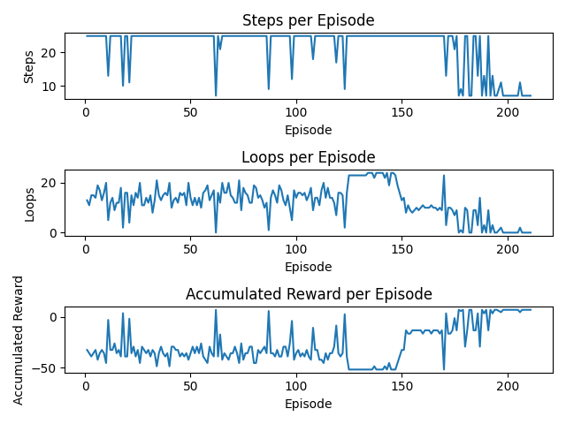

# Formal Verification of DRL Model in the Sokoban Game

In this project, we developed a Deep Reinforcement Learning (DRL) agent to solve levels of the classic Japanese game Sokoban. The project also explores the effect of formal neural network verification on the agent’s convergence speed.
## Table of Contents

- [Overview](#overview)
- [Installation](#installation)
- [Running](#running)
- [Results](#results)
- [Project Structure](#project-structure)
- [Authors](#authors)
## Overview

The goal of this project is to apply DRL to Sokoban and examine how formal verification impacts the learning process. Formal verification ensures that the neural network behaves according to certain properties, and this study focuses on how verification may improve training speed and model robustness.
## Installation

To set up the project, follow these steps:

1. **Clone the repository**:
   ```bash
   git clone https://github.com/Dekel23/Sokoban-DRL
   cd Sokoban-DRL
   ```

2. **Install the required Python packages**:
   ```bash
   pip install -r requirements.txt
   ```
   Alternatively, you can install the necessary packages manually:
   ```bash
   pip install json numpy matplotlib hyperopt torch pygame onnx
   ```
    
## Running

After installation, you can run the code with:

```bash
python main.py
```

To view all available options and parameters, use:

```bash
python main.py --help
```

**Examples**:

- Run with both search and test modes:
  ```bash
  python main.py --model=NN1 --iter=30 --level=62 --mode search test
  ```

- Test the CNN model with graphical output:
  ```bash
  python main.py --graphics=True --mode test --model=CNN --loops=False --max_step=50
  ```

- Run with custom rewards, levels, and episodes:
  ```bash
  python main.py --level=64 --reward_gen=Simple --max_episodes=1000 --iter=100
  ```

## Results

Here are examples of output results for running:
- **search mode:**
  ```json
  {
    "batch_size": 24,
    "beta": 1.0124,
    "epsilon": 1.0,
    "epsilon_decay": 0.9129,
    "epsilon_min": 0.0233,
    "gamma": 0.9451,
    "loop_decay": 0.9761,
    "loop_size": 5,
    "model_name": "NN2",
    "prioritized_batch_size": 8,
    "r_cold": -2.199,
    "r_done": 10.723,
    "r_hot": 1.024,
    "r_loop": -0.299,
    "r_move": 0,
    "r_waste": 0,
    "reward_name": "HotCold"
  }
  ```
- **test mode:**

  
## Project Structure

Here's a brief explanation of the directories and files in the project:
- `levels/`: Contains all available Sokoban levels in CSV format.
- `onnxs/`: Holds neural network models in ONNX format.
- `project_book/`: Contains LaTeX code and the PDF version of the project documentation.
- `graphics/`: Handles game visuals and rendering.
- `best_hyperparameters/`: Stores the best hyperparameters for each level, neural network model, reward generator, and loop mode.
- `results/`: Stores graphs showing the best simulation results for each combination of level, model, reward generator, and loop mode.
- `main.py`: Main entry point to run the DRL agent and set simulation parameters.
- `agent.py`: Defines the DRL agent.
- `model_factory.py`: Builds and initializes the neural network models.
- `game.py`: Implements Sokoban game mechanics.
- `reward_gen.py`: Defines the reward generator for the environment.
- `presentation.pptx`: PowerPoint presentation for the project.
## Authors

- [Erel Dekel](https://github.com/Dekel23)
- [Boaz Gurevich](https://github.com/boazgur)
- [Avraham Raviv](https://github.com/AvrahamRaviv)